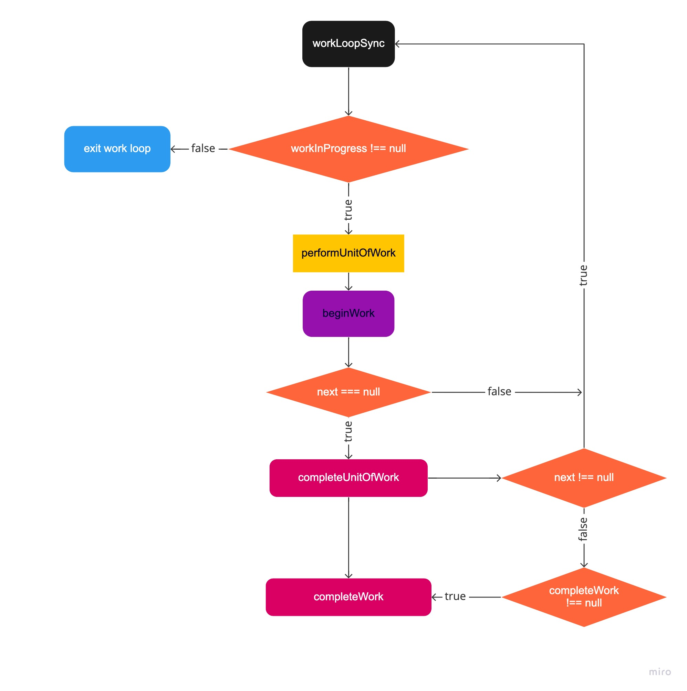

>React@17.0.2

## React如何把我们编写的JSX文件转化成DOM？

#### [渲染器（Renderer）](https://zh-hans.reactjs.org/docs/codebase-overview.html#renderers)
___

>渲染器用于管理一棵 React 树，使其根据底层平台进行不同的调用。

在React开发的项目中，react有对应不同版本的渲染器（Renderer）。有负责浏览器渲染的<b>ReactDOM</b>、渲染APP的<b>ReactNative</b>这两种常见的。还有<b>ReactTest</b>输出纯js对象进行测试、<b>ReactArt</b>渲染到Canvas、svg或VML（IE8）。

在浏览器中环境中所调用对应的eactDOM.render()方法渲染成DOM。render方法接收三个参数分别为所需要渲染的节点信息（element）、容器（一般为document.getElement("id")）、渲染成功或者更新后的回调（callback）。

第一个参数为渲染所需的节点信息element。而在日常中编写的代码都是采用JSX语法的形式进行编码的，那JSX是什么东西呢？
<br><br>
这是[官网的描述](https://react.docschina.org/docs/introducing-jsx.html)。

>是一个 JavaScript 的语法扩展。我们建议在 React 中配合使用 JSX，JSX 可以很好地描述 UI 应该呈现出它应有交互的本质形式。JSX 可能会使人联想到模板语言，但它具有 JavaScript 的全部功能。

JSX在编译时会被Babel编译为React.createElement方法。当然JSX并不是只能被编译成React.createElement，这与你配置的babel插件有关。
```jsx
// v17之前 显式声明React
// @babel/plugin-transform-react-jsx
<div className="Can-Chen" >
  <a href="https://github.com/Can-Chen" >个人介绍</a>
</div>
```

```js
// 经过babel编译后后成下面这样的结构
React.createElement(
  "div",
  {
    className: "Can-Chen"
  },
  React.createElement(
    "a",
    {
      href: "https://github.com/Can-Chen"
    },
    "个人介绍"
  )
)
```
createElement做了什么工作？ 省略部分代码
```js
export function createElement(type, config, children) {
  let propName;

  // Reserved names are extracted
  const props = {};

  let key = null;
  let ref = null;
  let self = null;
  let source = null;

  if (config != null) {
    // 处理config 并赋值给props
  }

  const childrenLength = arguments.length - 2;
  if (childrenLength === 1) {
  //  处理children
  }

  // Resolve default props
  if (type && type.defaultProps) {
  //  处理default props
  }

  return ReactElement(
    type,
    key,
    ref,
    self,
    source,
    ReactCurrentOwner.current,
    props,
  );
}
```
在React源码中，很明显处理了传入的type，config，children后，最后调用ReactElement方法，返回一个包含组件数据的对象<br><br>
省略部分代码
```js 
const ReactElement = function(type, key, ref, self, source, owner, props) {
  const element = {
    // 标记这是个 React Element
    $$typeof: REACT_ELEMENT_TYPE,

    type: type,
    key: key,
    ref: ref,
    props: props,

    // 记录负责创建此元素的组件。
    _owner: owner,
  };

  return element;
};
```

react应用用三种启动模式，官网上对于[这3种启动模式的介绍](https://zh-hans.reactjs.org/docs/concurrent-mode-adoption.html#why-so-many-modes), 基本说明如下:

1. legacy 模式: `ReactDOM.render(<App />, rootNode)`. 这是当前 React app 使用的方式. 这个模式可能不支持[这些新功能(concurrent 支持的所有功能)](https://zh-hans.reactjs.org/docs/concurrent-mode-patterns.html#the-three-steps).
   
2. [Blocking 模式](https://zh-hans.reactjs.org/docs/concurrent-mode-adoption.html#migration-step-blocking-mode): `ReactDOM.createBlockingRoot(rootNode).render(<App />)`. 目前正在实验中, 它仅提供了concurrent模式的小部分功能, 作为迁移到concurrent模式的第一个步骤.
  ```js
   // BolckingRoot
   // 1. 创建ReactDOMRoot对象
   const reactDOMBolckingRoot = ReactDOM.createBlockingRoot(
     document.getElementById('root'),
   );
   // 2. 调用render
   reactDOMBolckingRoot.render(<App />); // 不支持回调
   ```
3. [Concurrent 模式](https://zh-hans.reactjs.org/docs/concurrent-mode-adoption.html#enabling-concurrent-mode): `ReactDOM.createRoot(rootNode).render(<App />)`. 目前在实验中, 未来稳定之后，打算作为 React 的默认开发模式. 这个模式开启了所有的新功能.

   ```js
   // ConcurrentRoot
   // 1. 创建ReactDOMRoot对象
   const reactDOMRoot = ReactDOM.createRoot(document.getElementById('root'));
   // 2. 调用render
   reactDOMRoot.render(<App />); // 不支持回调
   ```

>注意: 虽然`17.0.2`的源码中有[`createRoot`和`createBlockingRoot`方法](https://github.com/facebook/react/blob/v17.0.2/packages/react-dom/src/client/ReactDOM.js#L202)(如果自行构建, [会默认构建`experimental`版本](https://github.com/facebook/react/blob/v17.0.2/scripts/rollup/build.js#L30-L35)), 但是稳定版的构建入口[排除掉了这两个 api](https://github.com/facebook/react/blob/v17.0.2/packages/react-dom/index.stable.js), 所以实际在`npm i react-dom`安装`17.0.2`稳定版后, 不能使用该 api.如果要想体验非`legacy`模式, 需要[显示安装 alpha 版本](https://github.com/reactwg/react-18/discussions/9)(或自行构建).

在这里我主要介绍经常使用的ReactDOM.render，也就是legacy模式.<br><br> 
ReactDOM.render做了什么？ 

> ReactDOM.render() 会控制你传入容器节点里的内容。当首次调用时，容器节点里的所有 DOM 元素都会被替换，后续的调用则会使用 React 的 DOM 差分算法（DOM diffing algorithm）进行高效的更新。<br><br>
> 不会修改容器节点（只会修改容器的子节点）。可以在不覆盖现有子节点的情况下，将组件插入已有的 DOM 节点中。

在图中我以Green代表绿框、Red代表红框、Blue代表蓝框。
1. Green在第一次执行React.render()方法时调用执行。
2. Red在第一次执行React.render()和更新都会执行。
3. Blue代表着开始把需要挂载的内容渲染到页面上。


ReactDOM.render()中的，render方法很简洁，执行了一个叫做legacyRenderSubtreeIntoContainer方法。也没有调用其它的方法或函数。<br><br>
省略部分代码
```js
export function render(
  element: React$Element<any>,
  container: Container,
  callback: ?Function,
) {

  return legacyRenderSubtreeIntoContainer(
    null,
    element,
    container,
    false,
    callback,
  );
};
```
省略部分代码
```js
function legacyRenderSubtreeIntoContainer(
  parentComponent: ?React$Component<any, any>,
  children: ReactNodeList,
  container: Container,
  forceHydrate: boolean,
  callback: ?Function,
) {

  let root: RootType = (container._reactRootContainer: any);
  let fiberRoot;
  if (!root) {
    // 首次调用
    root = container._reactRootContainer = legacyCreateRootFromDOMContainer(
      container,
      forceHydrate,
    );
    
    // 更新容器，先调用unbatchedUpdates，更改执行上下文legacyUnbatchedContenxt，之后调用updateContainer进行更新.
    unbatchedUpdates(() => {
      updateContainer(children, fiberRoot, parentComponent, callback);
    });
  } else {

    // 更新会走这一步流程
    updateContainer(children, fiberRoot, parentComponent, callback);
  }
  return getPublicRootInstance(fiberRoot);
}
```

关于root的定义 省略部分代码
```js
export type RootType = {
  render(children: ReactNodeList): void,
  unmount(): void,
  _internalRoot: FiberRoot,
  ...
};
```

但是在legacyRenderSubtreeIntoContainer方法中就会对这次执行进行判断。首次进入到该方法中时，因为在react的容器container中还未初始化react应用的环境，所以`container._reactRootContainer`返回的root字段为undefined，需要对root进行初始化，创建ReactDOMRoot对象，初始化react应用环境。从以下代码可以看出首次加载和更新都有调用`updateContainer`方法，该方法是在首次加载时不需要进行批量更新。
<br><br>
省略部分代码

```js
export function unbatchedUpdates<A, R>(fn: (a: A) => R, a: A): R {
  // 先保存当前值为prevExecutionContext
  const prevExecutionContext = executionContext;
  executionContext &= ~BatchedContext;
  executionContext |= LegacyUnbatchedContext;
  try {
    return fn(a);
  } finally {
    // 回调执行完毕之后，再恢复到以前的值
    executionContext = prevExecutionContext;
    if (executionContext === NoContext) {
      // 刷新此批处理期间计划的即时回调
      resetRenderTimer();
      flushSyncCallbackQueue();
    }
  }
}
```
在上图中标注框框的调用栈中可以看出，调用更新的入口是`updateContainer`函数.先删除一些无关的代码。初次渲染传入的参数`element`React的节点数据、`container`fiberRoot、`parentaComponent`为null、`callback`<br><br>
省略部分代码

```js
function updateContainer(
  element: ReactNodeList,
  container: OpaqueRoot,
  parentComponent: ?React$Component<any, any>,
  callback: ?Function,
): Lane {

  // current类型为Fiber，指向的是RootFiber（Fiber树的跟节点）
  const current = container.current;
  // 获取当前时间戳, 计算本次更新的优先级
  const eventTime = requestEventTime();
  // 创建一个优先级变量(车道模型)
  const lane = requestUpdateLane(current);

  // 根据车道优先级, 创建update对象
  const update = createUpdate(eventTime, lane);

  //设置update对象的payload, 这里element需要注意(是tag=HostRoot特有的设置, 指向<App/>) tag=0
  update.payload = {element};

  // 将新建的一个update对象加入的更新队列中（链表结构） fiber.updateQueue.pending队列
  enqueueUpdate(current, update);

  // 4. 进入reconciler运作流程中的`输入`环节
  scheduleUpdateOnFiber(current, lane, eventTime);

  return lane;
}
```
省略部分代码
```js
function createUpdate(eventTime: number, lane: Lane): Update<*> {
  const update: Update<*> = {
    eventTime, // 创建update的当前时间
    lane, // 调度优先级

    tag: UpdateState, // 状态标记
    payload: null, // 
    callback: null,

    next: null, // next指针
  };
  return update;
}
```

### render过程

#### scheduleUpdateOnFiber 省略部分代码
```js
function scheduleUpdateOnFiber(
  fiber: Fiber,
  lane: Lane,
  eventTime: number,
) {
  // 检查最大更新深度 50次 超过抛出错误
  checkForNestedUpdates();
  // 该方法只作用于Dev环境
  warnAboutRenderPhaseUpdatesInDEV(fiber);

  // 首次挂载传入的fiber为根fiber节点，fiber.return 为null tag为3 === HostTag(根节点)
  // 返回了fiber.stateNode
  const root = markUpdateLaneFromFiberToRoot(fiber, lane);

  // // legacy下, lane===Sync
  if (lane === SyncLane) {
    if (
      // 检查是否在批处理中
      (executionContext & LegacyUnbatchedContext) !== NoContext &&
      // 检查是否还没有渲染
      (executionContext & (RenderContext | CommitContext)) === NoContext
    ) {
      // 如果是本次更新是同步的，并且当前还未渲染，意味着主线程空闲，并没有React的
      // 更新任务在执行，那么调用performSyncWorkOnRoot开始执行同步任务
      performSyncWorkOnRoot(root);
    } else {
      
    }
  } else {
  }
}
```
#### performSyncWorkOnRoot 省略部分代码
看上方的调用图中，performSyncOnRoot调用栈分为两部分：renderRootSync 和 commitRoot。分别对应着render阶段和commit阶段
```js
function performSyncWorkOnRoot(root) {

  let lanes;
  let exitStatus;

  // 当前初次挂载 workInProgressRoot为空
  // 
  if (
    root === workInProgressRoot &&
    includesSomeLane(root.expiredLanes, workInProgressRootRenderLanes)
  ) {
  } else {
    lanes = getNextLanes(root, NoLanes);
    // 传入FiberRoot对象, 执行同步render
    exitStatus = renderRootSync(root, lanes);
  }

  // render结束之后, 设置fiberRoot.finishedWork(指向root.current.alternate)
  const finishedWork: Fiber = (root.current.alternate: any);
  root.finishedWork = finishedWork;
  root.finishedLanes = lanes;
  commitRoot(root);

  // 再次对fiberRoot进行调度，退出之前保证fiberRoot没有需要调度的任务
  ensureRootIsScheduled(root, now());

  return null;
}
```

#### renderRootSync 省略部分代码

```js
function renderRootSync(root: FiberRoot, lanes: Lanes) {
  // 缓存executionContext 描述当前在react执行栈中位置
  const prevExecutionContext = executionContext;

  // 位运算 更新在react执行栈中位置
  executionContext |= RenderContext;

  if (workInProgressRoot !== root || workInProgressRootRenderLanes !== lanes) {
    // 为当前render设置全新的stack，并设置公共变量workInProgress,workInProgressRoot,workInProgressRootRenderLanes等
    prepareFreshStack(root, lanes);
    startWorkOnPendingInteractions(root, lanes);
  }

  do {
    try {
      // 执行工作循环
      workLoopSync();
      break;
    } catch (thrownValue) {
      handleError(root, thrownValue);
    }
  } while (true);

  //在React生成执行之前调用，以确保“readContext”`
  //无法在渲染阶段之外调用。
  resetContextDependencies();

  // 重置该变量
  executionContext = prevExecutionContext;

  // 表明当前并没有进行的渲染
  workInProgressRoot = null;
  workInProgressRootRenderLanes = NoLanes;

  return workInProgressRootExitStatus;
}
```
prepareFreshStack 省略部分代码
```js
function prepareFreshStack(root: FiberRoot, lanes: Lanes) {

  root.finishedWork = null;
  root.finishedExpirationTime = NoWork;

  // 将root设置成全局workInProgressRoot
  workInProgressRoot = root;
  // 给Fiber对象创建一个alternate, 并将其设置成全局workInProgress
  workInProgress = createWorkInProgress(root.current, null);
  workInProgressRootRenderLanes = subtreeRenderLanes = workInProgressRootIncludedLanes = lanes;
  workInProgressRootExitStatus = RootIncomplete;
  workInProgressRootFatalError = null;
  workInProgressRootSkippedLanes = NoLanes;
  workInProgressRootUpdatedLanes = NoLanes;
  workInProgressRootPingedLanes = NoLanes;
}
```

##### workLoopSync 工作循环
```js
function workLoopSync() {
  // 第一次render, workInProgress=HostRootFiber
  // 循环执行 performUnitOfWork, 这里的workInProgress是从FiberRoot节点开始,依次遍历直到所有的Fiber都遍历完成
  while (workInProgress !== null) {
    performUnitOfWork(workInProgress);
  }
}
```
performUnitOfWork 省略部分代码
```js
function performUnitOfWork(unitOfWork: Fiber): void {

  // 第一次render时，unitOfWork = HostRootFiber，alternate已经初始化
  const current = unitOfWork.alternate;

  let next;
  if (enableProfilerTimer && (unitOfWork.mode & ProfileMode) !== NoMode) {
    startProfilerTimer(unitOfWork);
    // 创建Fiber节点
    next = beginWork(current, unitOfWork, subtreeRenderLanes);
    stopProfilerTimerIfRunningAndRecordDelta(unitOfWork, true);
  } else {
    next = beginWork(current, unitOfWork, subtreeRenderLanes);
  }

  unitOfWork.memoizedProps = unitOfWork.pendingProps;
  if (next === null) {
    // 深度优先的方式，到达深节点后，先进行completeWork，下一步可能进行兄弟节点的beginWork或继续completeWork父节点
    completeUnitOfWork(unitOfWork);
  } else {
    workInProgress = next;
  }

  ReactCurrentOwner.current = null;
}
```
performUnitOfWork对当前传入Fiber节点开始, 进行深度优先循环处理.

可以把workLoopSync的调用逻辑全部串联起来.



其中与工作循环相关主要有 4 个主要函数:

* `performUnitOfWork(unitOfWork: Fiber): void`
* `beginWork(current: Fiber | null, workInProgress: Fiber, renderLanes: Lanes,): Fiber | null`
* `completeUnitOfWork(unitOfWork: Fiber): void`
* `completeWork(current: Fiber | null, workInProgress: Fiber, renderLanes: Lanes,): Fiber | null`

每个 Fiber 对象的处理过程分为 2 个步骤:

1. `beginWork(current, unitOfWork, subtreeRenderLanes)`, `diff`算法在这里实现(由于初次 render 没有需要进行比较的对象, 都是新增, 正式的`diff`在`update`阶段)

   - 根据 reactElement 对象创建所有的 Fiber 节点, 构造 Fiber 树形结构(根据当前 Fiber 的情况设置`return`(父级)和`sibling`(兄弟)指针)
   - 给当前 Fiber 对象设置`effectTag`标记(二进制位, 用来标记 Fiber 的增,删,改状态)
   - 给抽象类型的 Fiber(如: class )对象设置`stateNode`(此时: `fiber.stateNode=new Class()`)

2. `completeUnitOfWork(unitOfWork)`, 处理 beginWork 阶段已经创建出来的 Fiber 节点.
   - 给 Fiber 节点(tag=HostComponent, HostText)创建 DOM 实例, fiber.stateNode 指向这个 DOM 实例,
   - 为 DOM 节点设置属性, 绑定事件(这里不做详细说明).
   - 把当前 Fiber 对象的 effects 队列添加到父节点 effects 队列之后, 更新父节点的`firstEffect`, `lastEffect`指针.
   - 根据 beginWork 阶段设置的`effectTag`判断当前 Fiber 是否有副作用(增,删,改), 如果有, 需要将当前 Fiber 加入到父节点的`effects`队列, 等待 commit 阶段处理.

##### beginWork 省略部分代码
```js
function beginWork(
  // 当前组件对应的Fiber节点在上一次更新时的Fiber节点，即workInProgress.alternate
  current: Fiber | null,
  // 当前组件对应的Fiber节点
  workInProgress: Fiber,
  // 优先级相关
  renderLanes: Lanes,
): Fiber | null {
  const updateLanes = workInProgress.lanes;

  // 初次渲染 只有rootFiber存在currentFiber树，其余的都为null
  // 先不用看更新
  if (current !== null) {
  } else {
    didReceiveUpdate = false;
  }

  workInProgress.lanes = NoLanes;

  switch (workInProgress.tag) {
    case IndeterminateComponent: {
      return mountIndeterminateComponent(
        ...
      );
    }
    case LazyComponent: {
      const elementType = workInProgress.elementType;
      return mountLazyComponent(
        ...
      );
    }
    case FunctionComponent: {
      ...
      return updateFunctionComponent(
        ...
      );
    }
    // 类组件
    case ClassComponent: {
     ...
      return updateClassComponent(
        ...
      );
    }
    // 根节点
    case HostRoot:
      return updateHostRoot(current, workInProgress, renderLanes);
    // 普通节点
    case HostComponent:
      return updateHostComponent(current, workInProgress, renderLanes);
    // 文本节点
    case HostText:
      return updateHostText(current, workInProgress);
      ...
}
```
这个函数是针对所有的 Fiber 类型, 其中的每一个 case 处理一种 Fiber 类型.

`updateXXX`函数(如: updateHostRoot, updateFunctionComponent 等)的主要逻辑有 3 个步骤:

1. 收集整合当前 Fiber 节点的必要状态属性(如: state, props)
   - 更新当前 Fiber 的`effectTag`
2. 获取下级`reactElement`对象
   * class 类型的 Fiber 节点
   - 构建`React.Component`实例,
     - 设置`fiber.stateNode`指向这个新的实例
     - 执行`render`之前的生命周期函数
     - 执行`render`方法, 获取下级`reactElement`
   - 更新当前节点的`effectTag`
   * function 类型的 Fiber 节点
   - 执行 function, 获取下级`reactElement`
     - `Fiber.memoizedState`指向`hook`队列
     - 初始化`Fiber.memoizedState`队列中的每一个`hook`对象, 使其拥有独立的`memoizedState`
   - 更新当前节点的`effectTag`
   * HostComponent 类型(如: div, span, button 等)的 Fiber 节点
   - `pendingProps.children`作为下级`reactElement`
     - 如果下级节点是文本节点,则设置下级节点为 null. 准备进入`completeUnitOfWork`阶段
   - 更新当前节点的`effectTag`
   * ...
3. 生成`Fiber`子树
   - `diff`算法, 设置子树 Fiber 节点的`effectTag`

updateHostComponent 省略部分代码
```js
function updateHostComponent(
  current: Fiber | null,
  workInProgress: Fiber,
  renderLanes: Lanes,
) {
  pushHostContext(workInProgress);

  if (current === null) {
    // return void
    tryToClaimNextHydratableInstance(workInProgress);
  }

  // 收集当前Fiber节点的必要状态属性
  // 节点类型
  const type = workInProgress.type;
  const nextProps = workInProgress.pendingProps;
  const prevProps = current !== null ? current.memoizedProps : null;

  let nextChildren = nextProps.children;
  // 判断当前子节点是否只存在一个文本节点，如果是并不会对这个子文本节点生成fiber节点
  const isDirectTextChild = shouldSetTextContent(type, nextProps);

  if (isDirectTextChild) {
    nextChildren = null;
  } else if (prevProps !== null && shouldSetTextContent(type, prevProps)) {
    // 从文本子节点转换为正常的字节点，需要把文本节点重置
    workInProgress.flags |= ContentReset;
  }

  // 更新当前fiber的effectTag
  markRef(current, workInProgress);
  // 生成fiber子树
  reconcileChildren(current, workInProgress, nextChildren, renderLanes);
  return workInProgress.child;
}
```

updateHostText 省略部分代码
```js
function updateHostText(current, workInProgress) {
  if (current === null) {
    tryToClaimNextHydratableInstance(workInProgress);
  }
  return null;
}
```
很显然，不管是在更新还是挂载阶段，对文本节点不会进行特殊的处理，直接就返回了。
<br>

updateHostRoot 省略部分代码

```js
function updateHostRoot(current, workInProgress, renderLanes) {
  pushHostRootContext(workInProgress);

  // 收集整合当前Fiber节点的必要状态属性(例如: state, props)
  const updateQueue = workInProgress.updateQueue;
  const nextProps = workInProgress.pendingProps;
  const prevState = workInProgress.memoizedState;
  const prevChildren = prevState !== null ? prevState.element : null;

  // clone一个updateQueue, 分离current和workInProgress对updateQueue的引用.
  // (以前是同一个引用, clone之后引用不同)方便后面processUpdateQueue
  cloneUpdateQueue(current, workInProgress);

  // 处理updateQueue,设置workInProgress的memoizedState,lanes等属性
  processUpdateQueue(workInProgress, nextProps, null, renderLanes);
  const nextState = workInProgress.memoizedState;

  // 获取下级的reactElement对象, 用于生成Fiber子树(HostRoot比较特殊, 直接拿到初始的react对象)
  const nextChildren = nextState.element;
  if (nextChildren === prevChildren) {
    resetHydrationState();
    return bailoutOnAlreadyFinishedWork(current, workInProgress, renderLanes);
  }
  const root: FiberRoot = workInProgress.stateNode;
  if (root.hydrate && enterHydrationState(workInProgress)) {
  } else {
    // 生产fiber子树，diff算法，设置子树fiber节点的effectTag
    reconcileChildren(current, workInProgress, nextChildren, renderLanes);
    resetHydrationState();
  }
  return workInProgress.child;
}
```
#### commitRoot 省略部分代码

```js
function commitRoot(root) {
  const renderPriorityLevel = getCurrentPriorityLevel();
  runWithPriority(
    ImmediateSchedulerPriority,
    commitRootImpl.bind(null, root, renderPriorityLevel),
  );
  return null;
}
```